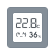
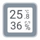

# 

[](https://travis-ci.org/emericg/WatchFlower)
[](https://ci.appveyor.com/project/emericg/watchflower)
[](http://www.gnu.org/licenses/gpl-3.0)


WatchFlower is a **plant monitoring application** that reads and plots data from compatible Bluetooth sensors like Xiaomi MiJia "Flower Care" and "RoPot" or Parrot "Flower Power" and "Parrot Pot", as well as many Bluetooth thermometers!
It works with international and Chinese Xiaomi devices, doesn't require an account creation, your GPS location, nor any other personal data from you!

Works on Linux, macOS, Windows, but also Android and iOS! Desktop binaries are available on the "release" page, mobile applications are on the app stores.  
Virtually all phones have Bluetooth "Low Energy", but you will need to make sure your computer has BLE capabilities (and for Windows, a working driver too).  

> Available in Danish, Dutch, English, French, Frysk, German, Norwegian Nynorsk, Russian and Spanish!

> Application developed by [Emeric Grange](https://emeric.io/). Visual design by [Chris Díaz](https://dribbble.com/chrisdiaz).

### Features

* Support plant sensors and thermometers
* Name your plants and set your own limits for optimal care
* Synchronize sensors history (FlowerCare ONLY for now)
* Background updates & notifications (desktop ONLY for now)
* Configurable update interval
* Clickable two-week graphs
* Monthly/weekly/daily data histograms
* CSV data export
* Scalable UI: 4.6" to 34" screens, landscape or portrait

TODOs:

* Background updates & notifications (Android, maybe iOS)
* Continuous measurements (BLE advertising support)

### Supported devices

WatchFlower has been built to be compatible with as many Bluetooth sensors as possible.  
Checkout out this [page](docs/README.md) to get more informations about the devices currently support, and get a peek at their Bluetooth APIs.  

| Flower Care | RoPot | Flower Power | Parrot Pot | HiGrow |
| :---------: | :---: | :----------: | :--------: | :----: |
|  |  |  |  |  |
| HHCCJCY01<br>GCLS002 | HHCCPOT002 | RKXHAWAII | 2AG61POT | |
| Xiaomi / VegTrug / WANFEI<br>(International and Chinese versions) | Xiaomi and VegTrug variants | | (monitoring only) | (with custom firmware) |
| [shop](https://www.banggood.com/custlink/DKKDVksMWv) | | | | [firmware](https://github.com/emericg/esp32-environmental-sensors/tree/master/HiGrow) |

| Xiaomi Digital Hygrometer (LCD) | ClearGrass Digital Hygrometer (EInk) | Xiaomi Smart Hygrometer Clock | Xiaomi Digital Hygrometer 2 (LCD) | MMC Digital Hygrometer 2 (EInk) |
| :-----------------------------: | :----------------------------------: | :---------------------------: | :------------------------: | :------------------------------------: |
|  |  |  |  |  |
| LYWSDCGQ | CGG1 | LYWSD02<br>MHO-C303 | LYWSD03MMC | MHO-C401 |
| [shop](https://www.banggood.com/custlink/3KDK5qQqvj) | [shop](https://www.banggood.com/custlink/KvKGHkAMDT) | [shop](https://www.banggood.com/custlink/v3GmHzAQ9k) / [shop](https://www.banggood.com/custlink/3DvyFIBoC7) | [shop](https://www.banggood.com/custlink/vG33kIGiqv) / [shop](https://www.banggood.com/custlink/Kv3DuJio9Q) | [shop](https://www.banggood.com/custlink/GGGdWczfB6) |

| ThermoBeacon (keychain) | ThermoBeacon (LCD) |
| :---------------------: | :----------------: |
|  | |
 2ACD3-WS02<br>2ACD3-WS07 | 2ACD3-WS08<br>KEU-WA59D |
| [shop]() | [shop](https://www.banggood.com/custlink/DKKYiqcRij) |

| ESP32 Air Monitor | ESP32 Geiger Counter |
| :---------------: | :------------------: |
|  |  |
| [build](https://github.com/emericg/esp32-environmental-sensors/tree/master/AirMonitor) | [build](https://github.com/emericg/esp32-environmental-sensors/tree/master/GeigerCounter) |

Various new Bluetooth devices and sensors could be added to WatchFlower. If you have one in mind, you can contact us and we'll see what can be done!  
You can also create your own sensors and use them with WatchFlower! Checkout this [guide](docs/howtwo-custom-sensor.md) to learn more about the process.  

### Screenshots


## Documentation

### Dependencies

You will need a C++11 compiler and Qt 5.12+ (with Qt Charts).  
For Android builds, the appropriates SDK and NDK.

### Building WatchFlower

```
$ git clone https://github.com/emericg/WatchFlower.git
$ cd WatchFlower/
$ qmake
$ make
```


## Special thanks

* Chris Díaz <christiandiaz.design@gmail.com> for his extensive work on the application design and logo!
* Mickael Heudre <mickheudre@gmail.com> for his invaluable QML expertise!
* Everyone who gave time to [help translate](i18n/README.md) this application!

### Third party projects used by WatchFlower

* Qt [website](https://www.qt.io) ([LGPL 3](https://www.gnu.org/licenses/lgpl-3.0.txt))
* StatusBar [website](https://github.com/jpnurmi/statusbar) ([MIT](https://opensource.org/licenses/MIT))
* SingleApplication [website](https://github.com/itay-grudev/SingleApplication) ([MIT](https://opensource.org/licenses/MIT))
* Graphical resources: [assets/COPYING](assets/COPYING)


## Get involved!

### Developers

You can browse the code on the GitHub page, submit patches and pull requests! Your help would be greatly appreciated ;-)

### Users

You can help us find and report bugs, suggest new features, help with translation, documentation and more! Visit the Issues section of the GitHub page to start!


## License

WatchFlower is free software; you can redistribute it and/or modify it under the terms of the GNU General Public License as published by the Free Software Foundation; either version 3 of the License, or (at your option) any later version.  
Read the [LICENSE](LICENSE) file or [consult the license on the FSF website](https://www.gnu.org/licenses/gpl-3.0.txt) directly.

> Emeric Grange <emeric.grange@gmail.com>
