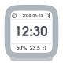
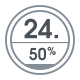
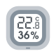

Supported devices
=================

# Plant sensors

| Flower Care                          | HHCC Plant Technology                 |
| ------------------------------------ | ------------------------------------- |
| Product ID                           | HHCCJCY01 / HHCCJCY10                 |
| FCC ID                               | 2AJEPHHCCJCY01HHCC / 2AJEPHHCCJCY10   |
|                                       ||
| Battery                              | 1 x CR2032                            |
| Soil moisture                        | 0 → 100%                              |
| Soil conductivity                    |                                       |
| Temperature                          | -15 → 50 °C (± 0.5 °C)                |
| Luminosity                           | 0 → 100k lux (± 100 lux)              |
| IP Code                              | IPX5                                  |
| BLE API                              | [link](flowercare-ble-api.md)         |

| Flower Care Max                      | HHCC Plant Technology                 |
| ------------------------------------ | ------------------------------------- |
| Product ID                           | HHCCJCY09 / GCLS002                   |
| FCC ID                               | 2AJEPHHCCJCY09 / 2AQPCGCLS002         |
|                                    ||
| Battery                              | Lithium Polymer (internal)            |
| Soil moisture                        | 0 → 100%                              |
| Soil conductivity                    |                                       |
| Temperature                          | -15 → 50 °C (± 0.5 °C)                |
| Luminosity                           | 0 → 100k lux (± 100 lux)              |
| IP Code                              | IPX6                                  |
| BLE API                              | [link](flowercare-ble-api.md)         |

| RoPot                                | HHCC Plant Technology                 |
| ------------------------------------ | ------------------------------------- |
| Product ID                           | HHCCPOT002                            |
| FCC ID                               | 2AJEPHHCCPOT002                       |
|                                            ||
| Battery                              | Lithium Polymer (internal)            |
| Soil moisture                        | 0 → 100%                              |
| Soil conductivity                    |                                       |
| Temperature                          | -15 → 50 °C (± 0.5 °C)                |
| IP Code                              | IPX6                                  |
| BLE API                              | [link](ropot-ble-api.md)              |

| Flower Power                         | Parrot                                |
| ---------------------------------    | ------------------------------------- |
| Product ID                           | RKXHAWAII                             |
|                                      ||
| Battery                              | 1 x AAA                               |
| Soil moisture                        | 0 → 50%                               |
| Soil conductivity                    |                                       |
| Soil temperature                     |                                       |
| Temperature                          | -5 → 55 °C                            |
| Luminosity                           | 0 → 1000 μmole.m-2.s-1                |
| IP Code                              | IPX5                                  |
| BLE API                              | [link](flowerpower-ble-api.md)        |

| Parrot Pot                           | Parrot                                |
| ------------------------------------ | ------------------------------------- |
| Product ID                           | 2AG61POT                              |
|                                        ||
| Battery                              | 4 x AA                                |
| Soil moisture                        | 0 → 50%                               |
| Soil conductivity                    |                                       |
| Soil temperature                     |                                       |
| Temperature                          | -5 → 55 °C                            |
| Luminosity                           | 0 → 1000 μmole.m-2.s-1                |
| Water tank                           | 2.2 l                                 |
| IP Code                              | IPX5                                  |
| BLE API                              | [link](parrotpot-ble-api.md)          |

| HiGrow                               | N/A                                   |
| ------------------------------------ | ------------------------------------- |
| Product ID                           | N/A                                   |
|                                           ||
| Battery                              | 1 x 18650 or 1 * Lithium Polymer      |
| Soil moisture                        |                                       |
| Soil conductivity                    |                                       |
| Temperature                          |                                       |
| Humidity                             |                                       |
| Luminosity                           |                                       |
| IP Code                              | None                                  |
| BLE API                              | [link](https://github.com/emericg/esp32-environmental-sensors/blob/master/HiGrow/doc/higrow-ble-api.md) |

# Thermometers

| Bluetooth Hygrometer (?)             | Miaomiaoce (?)                        |
| ------------------------------------ | ------------------------------------- |
| ID                                   | LYWSDCGQ/01ZM                         |
|                               ||
| Screen                               | LCD                                   |
| Battery                              | 1 x AAA                               |
| Temperature                          | -9.9 → 60 °C                          |
| Humidity                             | 0 → 99.9% RH                          |
| BLE API                              | [link](lywsdcgq-ble-api.md)           |

| Bluetooth Alarm Clock                | Qingping (formerly ClearGrass)        |
| ------------------------------------ | ------------------------------------- |
| ID                                   | CGD1                                  |
| FCC ID                               | 2AQ3F-CGD1                            |
|                                   ||
| Screen                               | LCD                                   |
| Battery                              | 2 x AAA                               |
| Temperature                          | -9.9 → 49.9 °C                        |
| Humidity                             | 0 → 100% RH                           |
| BLE API                              | [link](cgd1-ble-api.md)               |

| Temp & RH Barometer Pro S            | Qingping                              |
| ------------------------------------ | ------------------------------------- |
| ID                                   | CGP1W                                 |
|                                  ||
| Screen                               | LCD                                   |
| Battery                              | 1 x 18650 (internal)                  |
| Temperature                          | -30 → 55 °C (± 0.2 °C)                |
| Humidity                             | 0 → 100% RH (± 2% RH)                 |
| Air pressure                         | 300 → 1250 hPa (±0.5 hPa)             |
| BLE API                              | [link](cgp1w-ble-api.md)              |

| Temp & RH Monitor                    | Qingping (formerly ClearGrass)        |
| ------------------------------------ | ------------------------------------- |
| ID                                   | CGG1                                  |
| FCC ID                               | 2AQ3F-CGG1                            |
|                                   ||
| Screen                               | EInk                                  |
| Battery                              | 1 x CR2430                            |
| Temperature                          | 0 → 50 °C                             |
| Humidity                             | 0 → 99.9% RH                          |
| BLE API                              | [link](cgg1-ble-api.md)               |

| Temp & RH Monitor Lite               | Qingping                              |
| ------------------------------------ | ------------------------------------- |
| ID                                   | CGDK2                                 |
|                                  ||
| Screen                               | LCD                                   |
| Battery                              | 1 x CR2430                            |
| Temperature                          | -9.9 → 50 °C                          |
| Humidity                             | 0 → 99.9% RH                          |
| BLE API                              | [link](cgdk2-ble-api.md)              |

| Digital Hygrometer Clock (?)         | Miaomiaoce (MMC)                      |
| ------------------------------------ | ------------------------------------- |
| ID                                   | LYWSD02                               |
|                                  ||
| Screen                               | EInk                                  |
| Battery                              | 2 x CR2032                            |
| Temperature                          | 0 → 60 °C                             |
| Humidity                             | 0 → 99% RH                            |
| BLE API                              | [link](lywsd02-ble-api.md)            |

| Digital Hygrometer Alarm (?)         | Miaomiaoce (MMC)                      |
| ------------------------------------ | ------------------------------------- |
| ID                                   | MHO-C303                              |
|                                  ||
| Screen                               | EInk                                  |
| Battery                              | 2 x AAA                               |
| Temperature                          | 0 → 60 °C                             |
| Humidity                             | 0 → 99% RH                            |
| BLE API                              | [link](mhoc303-ble-api.md)            |

| Thermo-Hygrometer (?)                | Miaomiaoce (MMC)                      |
| ------------------------------------ | ------------------------------------- |
| ID                                   | LYWSD03MMC                            |
|                             ||
| Screen                               | LCD                                   |
| Battery                              | 1 x CR2032                            |
| Temperature                          | -9.9 → 60 °C (± 0.1 °C)               |
| Humidity                             | 0 → 99% RH (± 1% RH)                  |
| BLE API                              | [link](lywsd03mmc-ble-api.md)         |

| Thermo-Hygrometer (?)                | Miaomiaoce (MMC)                      |
| ------------------------------------ | ------------------------------------- |
| ID                                   | XMWSDJO4MMC                           |
|                            ||
| Screen                               | EInk                                  |
| Battery                              | 1 x CR2450                            |
| Temperature                          | 0 → 60 °C                             |
| Humidity                             | 0 → 99.9% RH                          |
| BLE API                              | [link](xmwsdjo4mmc-ble-api.md)        |

| Digital Hygrometer (?)               | Miaomiaoce (MMC)                      |
| ------------------------------------ | ------------------------------------- |
| ID                                   | MHO-C401                              |
|                                ||
| Screen                               | EInk                                  |
| Battery                              | 1 x CR2032                            |
| Temperature                          | 0 → 60 °C (± 0.3 °C)                  |
| Humidity                             | 0 → 99% RH (± 3% RH)                  |
| BLE API                              | [link](mhoc401-ble-api.md)            |

| ThermoBeacon (LCD)                   | SensorBlue / Brifit / ORIA / ?        |
| ------------------------------------ | ------------------------------------- |
| ID                                   | 2ACD3-WS08 / KEU-WA59D                |
|                              ||
| Screen                               | LCD                                   |
| Battery                              | 1 x CR2477                            |
| Temperature                          | -20 → 65 °C (± 0.5 °C)                |
| Humidity                             | 0 → 99% RH (± 5% RH)                  |
| BLE API                              | [link](thermobeacon-ble-api.md)       |

| ThermoBeacon (round keychain)        | SensorBlue / Brifit / ORIA / ?        |
| ------------------------------------ | ------------------------------------- |
| ID                                   | 2ACD3-WS02 / 2ACD3-WS07               |
|                               ||
| Screen                               | N/A                                   |
| Battery                              | 1 x CR2477                            |
| Temperature                          | -20 → 65 °C (± 0.5 °C)                |
| Humidity                             | 0 → 99% RH (± 5% RH)                  |
| BLE API                              | [link](thermobeacon-ble-api.md)       |

| ThermoBeacon (diamond keychain)      | SensorBlue / Brifit / ORIA / ?        |
| ------------------------------------ | ------------------------------------- |
| ID                                   | ‎WA63-BR                               |
|                             ||
| Screen                               | N/A                                   |
| Battery                              | 1 x CR2477                            |
| Temperature                          | -20 → 65 °C (± 0.5 °C)                |
| Humidity                             | 0 → 99% RH (± 5% RH)                  |
| BLE API                              | [link](thermobeacon-ble-api.md)       |

# Environmental sensors

| Air Box WP6003                       | VSON technology                       |
| ------------------------------------ | ------------------------------------- |
| ID                                   | ?                                     |
|                                           ||
| Screen                               | N/A                                   |
| Battery                              | N/A                                   |
| Temperature                          | -10 → 50 °C                           |
| TVOC                                 | 0 → 9.999 mg/m³                       |
| HCHO                                 | 0 → 1.999 mg/m³                       |
| CO2 (estimated)                      | 400 → 2000 ppm                        |
| BLE API                              | [link](wp6003-ble-api.md)             |

| Formaldehyde HCHO Monitor            | Honeywell                             |
| ------------------------------------ | ------------------------------------- |
| ID                                   | JQJCY01YM                             |
|                                        ||
| Screen                               | OLED                                  |
| Battery                              | 2 x AA                                |
| Temperature                          | 0 → 50 °C                             |
| Humidity                             | 0 → 99% RH                            |
| HCHO                                 | 0 → 1.500 mg/m³                       |
| BLE API                              | [link](jqjcy01ym-ble-api.md)          |

| Air Monitor Lite                     | Qingping (formerly ClearGrass)        |
| ------------------------------------ | ------------------------------------- |
| ID                                   | CGDN1                                 |
|                                            ||
| Screen                               | OLED                                  |
| Battery                              | 1 x 18650 (internal)                  |
| Temperature                          | 0 → 50 °C                             |
| Humidity                             | 0 → 99% RH                            |
| CO2                                  | 400 → 9999 ppm                        |
| PM2.5                                | 0 → 500 µg/m³                         |
| PM10                                 | 0 → 500 µg/m³                         |
| BLE API                              | [link](cgdn1-ble-api.md)              |

* Generic implementation for Bluetooth Low Energy "[Environmental Sensing Service](ess-ble-api.md)"

* ESP32 based Air Quality Monitoring platform, Weather Station and Geiger Counter. Check out the APIs documentations directly [on their repository](https://github.com/emericg/esp32-environmental-sensors).

* Make your [own sensor](howto-custom-sensor.md)!
