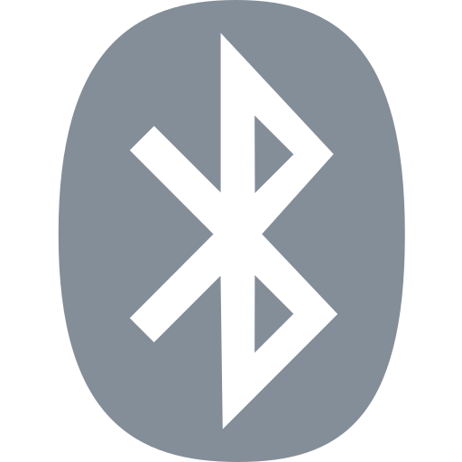

## About Bluetooth Low Energy "Environmental Sensing Service"

* TODO

## Protocol

The device uses BLE GATT for communication.  
Sensor values are immediately available for reading, through standard read/notify characteristics.  

### BLE & GATT

The basic technologies behind the sensors communication are [Bluetooth Low Energy (BLE)](https://en.wikipedia.org/wiki/Bluetooth_Low_Energy) and [GATT](https://www.bluetooth.com/specifications/gatt).
They allow the devices and the app to share data in a defined manner and define the way you can discover the devices and their services.
In general you have to know about services and characteristics to talk to a BLE device.

### Data structure

Bluetooth payload data typically uses little-endian byte order.  
This means that the data is represented with the least significant byte first.  

To understand multi-byte integer representation, you can read the [endianness](https://en.wikipedia.org/wiki/Endianness) Wikipedia page.

## Services, characteristics and handles

The name advertised will be dependent on the device used.  

##### Generic access (UUID 00001800-0000-1000-8000-00805f9b34fb)

| Characteristic UUID                  | Access      | Description                   |
| ------------------------------------ | ----------- | ----------------------------- |
| 00002a00-0000-1000-8000-00805f9b34fb | read        | device name                   |

##### Battery service (UUID 0000180f-0000-1000-8000-00805f9b34fb)

| Characteristic UUID                  | Access      | Description                   |
| ------------------------------------ | ----------- | ----------------------------- |
| 00002a19-0000-1000-8000-00805f9b34fb | read        | battery level                 |

##### Environmental Sensing Service (UUID 0000181A-0000-1000-8000-00805f9b34fb)

| Characteristic UUID                  | Access      | Description                   |
| ------------------------------------ | ----------- | ----------------------------- |
| 00002a6c-0000-1000-8000-00805f9b34fb | read/notify | elevation                     |
| 00002a6d-0000-1000-8000-00805f9b34fb | read/notify | pressure                      |
| 00002a6e-0000-1000-8000-00805f9b34fb | read/notify | temperature                   |
| 00002a6f-0000-1000-8000-00805f9b34fb | read/notify | humidity                      |
| 00002a70-0000-1000-8000-00805f9b34fb | read/notify | true wind speed               |
| 00002a71-0000-1000-8000-00805f9b34fb | read/notify | true wind direction           |
| 00002a72-0000-1000-8000-00805f9b34fb | read/notify | apparent wind speed           |
| 00002a73-0000-1000-8000-00805f9b34fb | read/notify | apparent wind direction       |
| 00002a74-0000-1000-8000-00805f9b34fb | read/notify | gust factor                   |
| 00002a75-0000-1000-8000-00805f9b34fb | read/notify | pollen concentration          |
| 00002a76-0000-1000-8000-00805f9b34fb | read/notify | UV index                      |
| 00002a77-0000-1000-8000-00805f9b34fb | read/notify | irradiance                    |
| 00002a78-0000-1000-8000-00805f9b34fb | read/notify | rainfall                      |
| 00002a79-0000-1000-8000-00805f9b34fb | read/notify | wind chill                    |
| 00002a7a-0000-1000-8000-00805f9b34fb | read/notify | heat index                    |
| 00002a7b-0000-1000-8000-00805f9b34fb | read/notify | dew point                     |
| 00002aa3-0000-1000-8000-00805f9b34fb | read/notify | barometric pressure trend     |
| 00002a2c-0000-1000-8000-00805f9b34fb | read/notify | magnetic declination          |
| 00002aa0-0000-1000-8000-00805f9b34fb | read/notify | magnetic flux density 2d      |
| 00002aa1-0000-1000-8000-00805f9b34fb | read/notify | magnetic flux density 3d      |

#### Battery

A read request to the battery characteristic will return 4 bytes of data, for example `0x64000000`.

| Position | 00 | 01 | 02 | 03 |
| -------- | -- | -- | -- | -- |
| Value    | 64 | 00 | 00 | 00 |

| Bytes | Type       | Value | Description        |
| ----- | ---------- | ----- | ------------------ |
| all   | ASCII text | 100   | battery level      |

#### Environmental Sensing

##### Elevation

| Type      | Value (raw) | Value     | Description                            | Link |
| --------- | ----------- | --------- | -------------------------------------- | ---- |
| int24_le  | 10000       | 100.00 m  | Unit is in meters with a resolution of 0.01 m | [link](https://github.com/oesmith/gatt-xml/blob/master/org.bluetooth.characteristic.elevation.xml) |

##### Barometric Pressure

| Type      | Value (raw) | Value     | Description                            | Link |
| --------- | ----------- | --------- | -------------------------------------- | ---- |
| uint32_le | 10130       | 1013.0 Pa | Unit is in pascals with a resolution of 0.1 Pa | [link](https://github.com/oesmith/gatt-xml/blob/master/org.bluetooth.characteristic.pressure.xml) |

##### Temperature

| Type      | Value (raw) | Value     | Description                            | Link |
| --------- | ----------- | --------- | -------------------------------------- | ---- |
| int24_le  | -564        | -5.64 °C  | Unit is in degrees Celsius with a resolution of 0.01 °C | [link](https://github.com/oesmith/gatt-xml/blob/master/org.bluetooth.characteristic.temperature.xml) |

##### Humidity

| Type      | Value (raw) | Value     | Description                            | Link |
| --------- | ----------- | --------- | -------------------------------------- | ---- |
| int24_le  | 5000        | 50.00 %   | Unit is in percent with a resolution of 0.01 % | [link](https://github.com/oesmith/gatt-xml/blob/master/org.bluetooth.characteristic.humidity.xml) |

##### Others (todo)

- https://www.bluetooth.com/wp-content/uploads/Sitecore-Media-Library/Gatt/Xml/Characteristics/org.bluetooth.characteristic.true_wind_speed.xml
- https://www.bluetooth.com/wp-content/uploads/Sitecore-Media-Library/Gatt/Xml/Characteristics/org.bluetooth.characteristic.true_wind_direction.xml
- https://www.bluetooth.com/wp-content/uploads/Sitecore-Media-Library/Gatt/Xml/Characteristics/org.bluetooth.characteristic.apparent_wind_speed.xml
- https://www.bluetooth.com/wp-content/uploads/Sitecore-Media-Library/Gatt/Xml/Characteristics/org.bluetooth.characteristic.apparent_wind_direction.xml
- https://www.bluetooth.com/wp-content/uploads/Sitecore-Media-Library/Gatt/Xml/Characteristics/org.bluetooth.characteristic.gust_factor.xml
- https://www.bluetooth.com/wp-content/uploads/Sitecore-Media-Library/Gatt/Xml/Characteristics/org.bluetooth.characteristic.pollen_concentration.xml
- https://www.bluetooth.com/wp-content/uploads/Sitecore-Media-Library/Gatt/Xml/Characteristics/org.bluetooth.characteristic.uv_index.xml
- https://www.bluetooth.com/wp-content/uploads/Sitecore-Media-Library/Gatt/Xml/Characteristics/org.bluetooth.characteristic.irradiance.xml
- https://www.bluetooth.com/wp-content/uploads/Sitecore-Media-Library/Gatt/Xml/Characteristics/org.bluetooth.characteristic.rainfall.xml
- https://www.bluetooth.com/wp-content/uploads/Sitecore-Media-Library/Gatt/Xml/Characteristics/org.bluetooth.characteristic.wind_chill.xml
- https://www.bluetooth.com/wp-content/uploads/Sitecore-Media-Library/Gatt/Xml/Characteristics/org.bluetooth.characteristic.heat_index.xml
- https://www.bluetooth.com/wp-content/uploads/Sitecore-Media-Library/Gatt/Xml/Characteristics/org.bluetooth.characteristic.dew_point.xml
- https://www.bluetooth.com/wp-content/uploads/Sitecore-Media-Library/Gatt/Xml/Characteristics/org.bluetooth.characteristic.barometric_pressure_trend.xml
- https://www.bluetooth.com/wp-content/uploads/Sitecore-Media-Library/Gatt/Xml/Characteristics/org.bluetooth.characteristic.magnetic_declination.xml

## Advertisement data

None

## Reference

[1] https://www.bluetooth.com/specifications/specs/environmental-sensing-profile-1-0/  
[2] https://www.bluetooth.com/specifications/specs/environmental-sensing-service-1-0/  
[3] https://www.bluetooth.com/specifications/assigned-numbers/environmental-sensing-service-characteristics/  

## License

MIT
