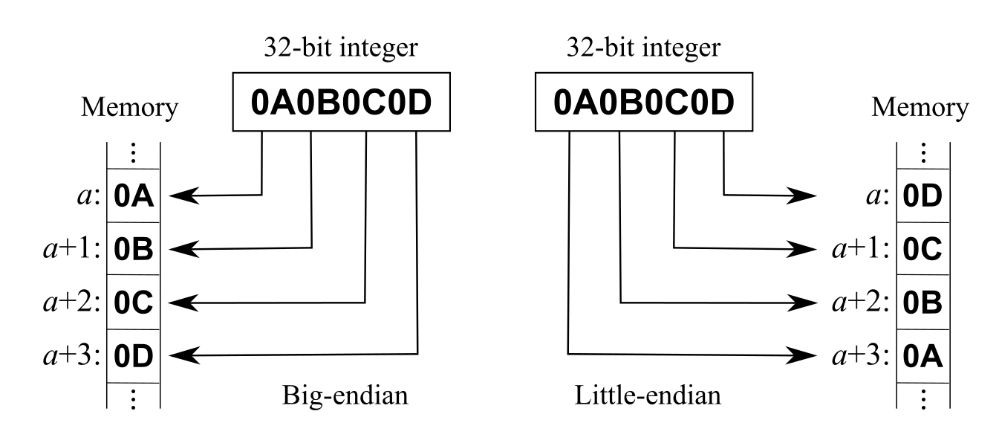

## About XMWSDJO4MMC

* Miaomiaoce (MMC) 'Thermo-Hygrometer' [XMWSDJO4MMC]() are hygrometers
* Has sensors to relay temperature and humidity
* Uses Bluetooth Low Energy (BLE) and has a limited range
* A CR2450 coin cell battery is used as power source

## Features

* Read real-time sensor values
* Read historical sensor values
* Temperature and humidity sensors

## Protocol

The device uses BLE GATT for communication.  
Sensor values are immediately available for reading.  

### BLE & GATT

The basic technologies behind the sensors communication are [Bluetooth Low Energy (BLE)](https://en.wikipedia.org/wiki/Bluetooth_Low_Energy) and [GATT](https://www.bluetooth.com/specifications/gatt).
They allow the devices and the app to share data in a defined manner and define the way you can discover the devices and their services.
In general you have to know about services and characteristics to talk to a BLE device.

### Data structure

Bluetooth payload data typically uses little-endian byte order.  
This means that the data is represented with the least significant byte first.  

To understand multi-byte integer representation, you can read the [endianness](https://en.wikipedia.org/wiki/Endianness) Wikipedia page.

## Services, characteristics and handles

The name advertised by the devices is `XMWSDJO4MMC`.  

TODO

## Historical data

TODO

## Advertisement data

TODO

## Reference

[1] TODO

## License

MIT
